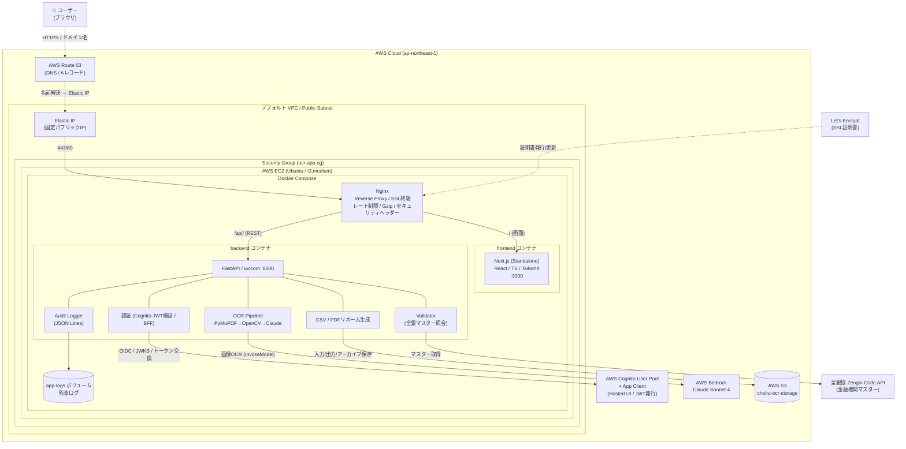
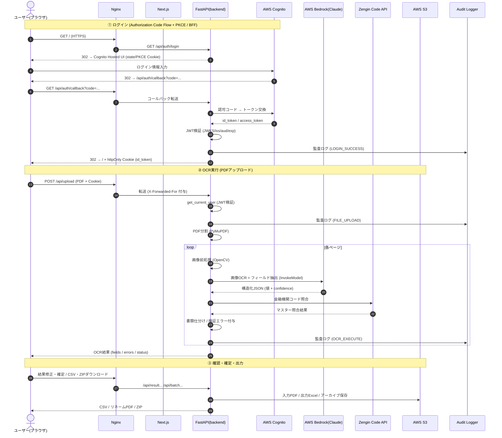
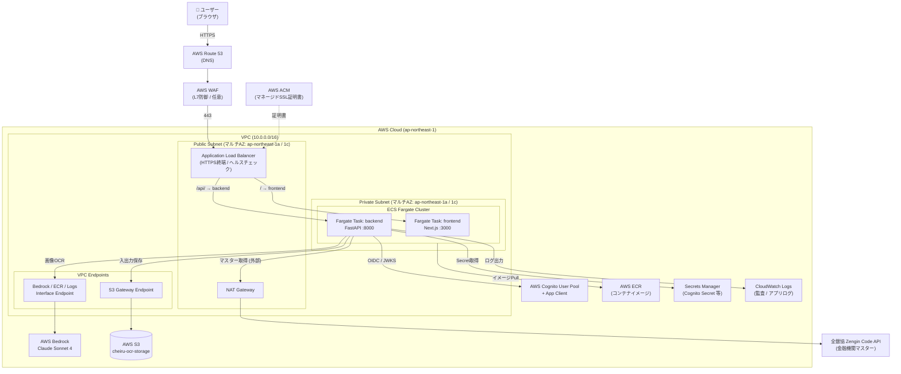

# OCR口座振替依頼書処理システム — システム構成図

本ドキュメントは、現在構築されているOCR Webアプリケーションの全体システム構成を、実際のソースコード（`docker-compose.yml` / `nginx.conf` / `backend/` 各モジュール）に基づいて記述したものです。

> 注記: ユーザー提示の構成要素に加えて、実装コードから判明した以下の要素を反映しています。
> - OCRエンジンは **AWS Bedrock (Claude Sonnet 4)** による画像直接OCR（`textract_client.py` は存在するがパイプライン未使用）
> - **AWS S3**（入力PDF / 出力Excel / アーカイブZIP の保存）
> - **全銀協 Zengin Code API**（金融機関マスター検証）
> - 認証は Cognito Hosted UI + Authorization Code Flow (PKCE) + **BFF方式（httpOnly Cookie）**

---

## 1. 構成要素の役割

### クライアント層

| 構成要素 | 役割 |
| --- | --- |
| **ユーザー (Client / ブラウザ)** | Web UIを操作し、PDFをアップロード、OCR結果の確認・修正、CSV/ZIPダウンロードを行う。認証トークンは httpOnly Cookie に保持され、JavaScriptからは参照不可（XSS対策）。 |

### ネットワーク / インフラ層

| 構成要素 | 役割 |
| --- | --- |
| **AWS Route 53** | ドメイン名の名前解決（DNS）。独自ドメイン（例: `ai-ocr.ksai-dev.com`）を、EC2に紐づくElastic IPへAレコードでルーティングするManaged DNS。 |
| **AWS Elastic IP** | EC2インスタンスに関連付ける固定パブリックIP。インスタンス再起動でパブリックIPが変わっても、Route 53のAレコードを変更せずに済むよう、DNSの向き先を固定する。 |
| **AWS VPC / デフォルトVPC** | EC2が所属する仮想ネットワーク。現行はデフォルトVPCのPublic Subnet上に単一インスタンスを配置し、Elastic IP経由でインターネットに直接公開する構成。 |
| **AWS Security Group (`ocr-app-sg`)** | EC2のインスタンス単位ファイアウォール（ステートフル）。インバウンドは SSH(22)=マイIPのみ / HTTP(80)=0.0.0.0/0 / HTTPS(443)=0.0.0.0/0 に限定。アウトバウンドは全許可（Bedrock/S3/Zengin/Cognitoへの通信用）。 |
| **AWS EC2 (Ubuntu 22.04 / t3.medium)** | アプリケーション実行ホスト。Docker Composeで全コンテナを起動する。BedrockとS3へのアクセスはIAMロール（`ocr-app-ec2-role`）で付与し、インスタンス内にAWSキーを保存しない。 |
| **Nginx (Reverse Proxy)** | SSL/TLS終端（HTTPS）、HTTP→HTTPSリダイレクト、リバースプロキシ（`/` → frontend、`/api/` → backend）、レート制限（DDoS対策）、Gzip圧縮、アップロードサイズ上限（50MB）、セキュリティヘッダー付与、`X-Forwarded-For` 付与。 |
| **Let's Encrypt** | SSL証明書の発行・更新。Nginxが `/.well-known/acme-challenge/` でACMEチャレンジに応答。 |

### アプリケーション層 (Docker Compose)

| 構成要素 | 役割 |
| --- | --- |
| **frontend (Next.js / Standalone)** | Web UIの提供。React + TypeScript + Tailwind CSS。ポート3000で起動。 |
| **backend (FastAPI / uvicorn)** | REST APIサーバー。ポート8000で起動。認証・OCRパイプライン・検証・CSV/PDF生成・監査ログを統括。 |

### バックエンド内部モジュール

| モジュール | 役割 |
| --- | --- |
| **auth router (`routers/auth.py`)** | Cognito Hosted UIへのログインリダイレクト、認可コード→トークン交換、httpOnly Cookie設定、ログアウト、`/api/auth/me`。 |
| **auth service (`services/auth.py`)** | Cognito発行のJWT検証（署名/iss/aud/exp）。JWKS公開鍵をキャッシュ。Cognito Groupからロール（`ocr-admin`/`ocr-user`）を抽出し認可。 |
| **upload router (`routers/upload.py`)** | PDFアップロード受付、ページ単位分割、OCRパイプライン起動。 |
| **batch router (`routers/batch.py`)** | 複数PDFの一括アップロードとバックグラウンド処理、進捗取得、CSV/ZIPダウンロード。 |
| **result router (`routers/result.py`)** | OCR結果の取得・修正・確認、CSV/リネームPDF生成。 |
| **OCR Pipeline (`services/ocr_pipeline.py`)** | PDF読込(PyMuPDF) → 画像前処理(OpenCV) → Claude OCR → 結果構築 → 検証 のオーケストレーション。 |
| **Claude Client (`services/claude_client.py`)** | AWS Bedrock (Claude Sonnet 4) を呼び出し、画像から構造化フィールドを1回のAPIで抽出。 |
| **Validator (`services/validator.py`)** | 必須項目チェック、銀行/店番号の桁数・入替修正、全銀マスターとの照合。 |
| **Zengin Master (`services/zengin_master.py`)** | 全銀協 Zengin Code API から金融機関マスターを取得しキャッシュ（`data/zengin_cache`）。 |
| **CSV Generator / PDF Renamer** | 確定データからCSV出力、原本PDFの規則的リネーム。 |
| **S3 Storage (`services/s3_storage.py`)** | 入力PDF(ZIP)・出力Excel・アーカイブZIPをS3バケット `cheiru-ocr-storage` に保存。 |
| **Audit Logger (`services/audit_logger.py`)** | ログイン/ログアウト、ファイルアップロード、OCR実行等の監査イベントをJSON Lines形式で記録（日次ファイル分割、`app-logs`ボリューム）。 |

### 外部AWSサービス

| 構成要素 | 役割 |
| --- | --- |
| **AWS Cognito User Pool** | 認証基盤（IdP）本体。ユーザー/グループ（`ocr-admin`/`ocr-user`）の管理、JWT（id_token/access_token）の発行、Hosted UIによるログイン画面の提供を行う。将来的にEntra ID等の外部IdPフェデレーションのハブとしても機能。 |
| **AWS Cognito App Client** | User Poolに紐づくアプリケーション登録単位。OAuth 2.0 / OIDCの `client_id`・`client_secret`、許可するフロー（Authorization Code + PKCE）、コールバックURL（`/api/auth/callback`）、ログアウトURLを保持。バックエンド（FastAPI）はこのApp Clientの資格情報でトークン交換を行う。 |
| **AWS Bedrock (Claude Sonnet 4)** | OCR + 文書理解エンジン。東京リージョンのInference Profileを利用。 |
| **AWS S3** | 入力・出力・アーカイブファイルの永続ストレージ。 |
| **全銀協 Zengin Code API** | 金融機関コード/支店コードのマスターデータ提供（外部・GitHub Pages）。 |

---

## 2. Mermaid 形式

### 2.1 システム全体構成図

### 2.2 ログイン〜OCR実行 データフロー（シーケンス図）

---

## 3. Draw.io 形式

編集可能な作図ファイルを `docs/system-architecture.drawio` に同梱しています。[app.diagrams.net](https://app.diagrams.net/) またはVS Codeの「Draw.io Integration」拡張機能で開いてください。

このファイルには2つのページ（タブ）が含まれます。

| ページ名 | 内容 |
| --- | --- |
| **現行構成 (EC2 / Docker Compose)** | 第2.1節に対応。Route 53 → Elastic IP → Security Group → EC2上のDocker Composeコンテナ群、および外部AWSサービス（Cognito / Bedrock / S3）とZengin APIとの関係。 |
| **将来推奨構成 (Private Subnet + ALB + ECS Fargate)** | 第5節に対応。VPC / マルチAZ / Public・Private Subnet / ALB / ECS Fargate / NAT Gateway / VPCエンドポイントを含むマネージド構成。 |

---

## 4. セキュリティ観点での説明（現行構成）

現行構成は「EC2 1台 + Docker Compose」というシンプルな形ですが、多層防御（Defense in Depth）の考え方で各層に対策を配置しています。

### 4.1 ネットワーク境界の防御

| 層 | 対策 | 内容 |
| --- | --- | --- |
| DNS | Route 53 | ドメイン名の名前解決のみを担い、バックエンドの実IPを直接露出しない。 |
| 固定IP | Elastic IP | インスタンス再起動でIPが変わらないため、ファイアウォールやDNSの設定を安定運用できる。 |
| ファイアウォール | Security Group (`ocr-app-sg`) | **SSH(22)は運用者のマイIPのみ許可**し、全世界公開しない。公開ポートはHTTP(80)/HTTPS(443)に限定。ステートフルなので戻り通信は自動許可。 |
| 暗号化 | Nginx + Let's Encrypt | 全通信をHTTPSで暗号化。HTTP(80)は443へリダイレクトのみ。 |
| レイヤ7 | Nginx | レート制限（DoS緩和）、アップロードサイズ上限（50MB）、セキュリティヘッダー付与、`/api/` と `/` のパスベース振り分け。 |

> **現行構成の弱点**: EC2がPublic Subnet上でElastic IP経由でインターネットに直接公開されており、アプリケーションホストが攻撃対象面（Attack Surface）に晒される。SSHポートも（マイIP限定とはいえ）インスタンスに直接存在する。これらは第5節の将来構成で緩和される。

### 4.2 認証・認可

- **Authorization Code Flow + PKCE**: 認可コードを用いる標準的なOIDCフロー。トークンがURLフラグメントに乗らず、PKCEで認可コード横取り攻撃を防ぐ。
- **BFF方式（httpOnly Cookie）**: Cognito発行のJWTをブラウザのJavaScriptから読めないhttpOnly Cookieに格納するため、XSSによるトークン窃取リスクを大幅に低減。
- **JWT検証**: バックエンドがJWKS公開鍵で署名・`iss`・`aud`・`exp` を検証。Cognito App Clientの `client_id` と一致しないトークンは拒否。
- **ロールベース認可**: Cognito Group（`ocr-admin` / `ocr-user`）からロールを抽出し、APIごとに権限を制御。
- **App Client Secret**: サーバー側（FastAPI）でのみ保持し、フロントエンドには露出しない。

### 4.3 認証情報・データ保護

- **IAMロール方式**: EC2に `ocr-app-ec2-role` を付与し、Bedrock/S3へのアクセスに長期AWSキーをインスタンス内へ置かない。`.env` にアクセスキーを書かない運用が可能。
- **最小権限の原則（推奨）**: FullAccessではなく、対象バケット（`cheiru-ocr-storage`）に限定したカスタムポリシーへ絞ることを推奨。
- **監査ログ**: ログイン/ログアウト、アップロード、OCR実行などをJSON Lines形式で永続化し、追跡可能性（Traceability）を確保。
- **機微情報の非露出**: `.env`（Cognito Client Secret等）はGit管理外。個人情報を含むPDFはS3へ保存し、EC2ローカルには一時ファイルのみ。

### 4.4 可用性・運用

- `restart: unless-stopped` とヘルスチェックにより、コンテナ異常時は自動再起動。
- Let's Encrypt証明書はcronで自動更新。
- **単一障害点（SPOF）**: EC2 1台構成のため、インスタンス障害・AZ障害でサービス全体が停止する。冗長化は第5節の構成で解決される。

---

## 5. 将来推奨構成（Private Subnet + ALB + ECS Fargate）

現行のEC2単体構成を、マネージド・冗長化・最小攻撃面を重視した構成へ発展させる案です。アプリケーションコンテナをPrivate Subnetに隔離し、インターネットからは Application Load Balancer (ALB) のみを公開します。

### 5.1 主な変更点

| 観点 | 現行 (EC2) | 将来 (ECS Fargate) |
| --- | --- | --- |
| 実行基盤 | EC2 + Docker Compose（自己管理） | ECS Fargate（サーバーレス・OS管理不要） |
| 公開点 | Elastic IP付きEC2を直接公開 | ALBのみ公開。アプリはPrivate Subnetに隔離 |
| 冗長化 | 単一インスタンス（SPOF） | マルチAZ + タスク複数 + オートスケール |
| SSL終端 | Nginx + Let's Encrypt（手動更新） | ALB + ACM（自動更新・マネージド証明書） |
| 外部AWSアクセス | NAT不要（Public Subnet） | NAT Gateway + VPCエンドポイント経由 |
| SSHポート | インスタンスに存在 | 不要（Fargateはホストレス。運用はSSM/ECS Exec） |
| スケール | 手動（インスタンスタイプ変更） | タスク数の水平スケール |

### 5.2 構成図（Mermaid）

### 5.3 セキュリティ上の改善点

- **最小攻撃面**: アプリコンテナはPrivate Subnetに置き、インターネットから直接到達不可。公開点はALBのみ。
- **SSH不要**: Fargateはホストを管理しないためSSHポートが存在しない。運用操作はECS Exec / SSM Session Managerで代替でき、踏み台やキー管理が不要。
- **マネージドSSL**: ACMがALBの証明書を自動発行・更新。Let's Encryptの手動運用（cron）を廃止。
- **多層防御の追加**: ALB前段にWAFを置くことで、SQLインジェクションや既知の攻撃パターンをL7でブロック可能（任意）。
- **VPCエンドポイント**: S3/Bedrock/ECR/CloudWatchへの通信をAWS内部ネットワークで完結させ、インターネット経由の通信を減らす。外部通信（Zengin API）のみNAT Gateway経由。
- **Secrets Manager**: Cognito Client SecretなどをSecrets Managerで一元管理し、`.env` 平文管理から脱却。
- **可用性**: マルチAZ + 複数タスク + オートスケールにより、AZ障害・負荷急増に耐える。SPOFを解消。

### 5.4 移行時の考慮点

- **Nginxの役割再配置**: SSL終端・パスルーティングはALBに移譲。ただしレート制限・詳細なヘッダー制御が必要なら、backendタスク前段にNginxサイドカーを残す選択肢もある。
- **セッション/状態**: Fargateタスクはステートレスが前提。一時ファイルはS3または共有ストレージ（EFS）へ。BFFのCookieは引き続き利用可能。
- **監査ログ**: ローカルボリュームからCloudWatch Logs（または引き続きS3）へ出力先を変更。
- **コスト**: ALB / NAT Gateway / Fargate の固定費が増える一方、運用（OSパッチ・冗長化）の手間は減る。トラフィックと運用体制に応じて判断する。
